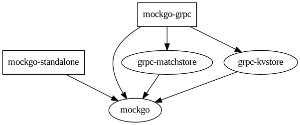

# contribute

## general

Development guides are applied on a linux amd64 system. Please understand that my support capatibilties are limited regarding other setups. Vscode was used as IDE, however this repo does not contain any relevant files regarding IDE usage.

## multi module repository

The repository consists of 5 go modules with the following dependencies:

In order to manage multi modules in one repo [go-workspaces](https://go.dev/blog/get-familiar-with-workspaces) are used for development, this requires at least **go version 1.19**.

## make targets

There are a lot of [make rules](https://www.gnu.org/software/make/) available to check your changes before a commit. Starting from:

- `make env` : check your environment and the installed tools,

and ending with:

- `make acctest` : run acceptance test ( builds executable, create docker image, setup local kubernetes cluster, deploy the app with helm, run acceptance test)

The whole spectrum of make targets can be found in the [Makefile](Makefile). 

## grpc

As the [grpc]() variant is using [protobuf](https://developers.google.com/protocol-buffers), you need to install the protobuf compiler and its go tools.

## testing and releasing with `create-release.sh`

Executing the `create-release.sh` script will go through all steps of [test pyramid](https://martinfowler.com/articles/practical-test-pyramid.html) for each module. Without giving a tag as argument, the script stops at this point. This process is applied as check for each pull request.

Providing a version as argument will create a release. The basic steps are:
- create a branch with the version name,
- tag to the remote
- publish the go modules with under the version
- create release on github
- push the docker images with the version tag on dockerhub
